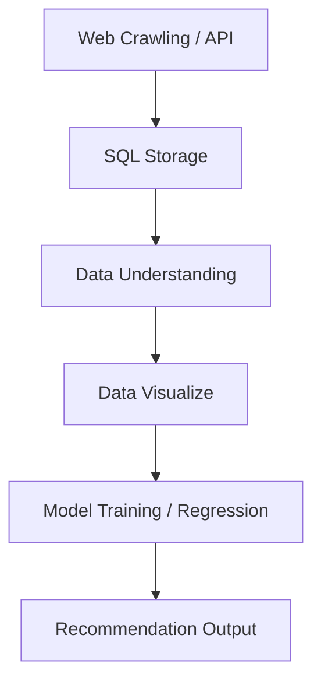

# 🎧 Song Recommendation System using Spotify Data 
A data-driven **Song Recommendation System** that predicts and recommends similar tracks baseds on audio features, genre, and popularity — powered by **Python, SQL, and Machine Learning**.

---

## ⚙️ Tech Stack 
|Category| Tools / Libraries|
|--------|-----------------|
|DATA SOURCES| Spotify API, Selenium, MusicBrainz API|
|DATABASE| SQL Server (via pyodbc)|
|VISUALIZATION| Matplotlib, Seaborn|

---

## 🧱 3. Data Pipeline

## 4.SQL Storage

